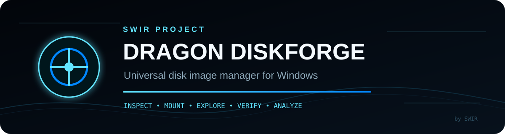
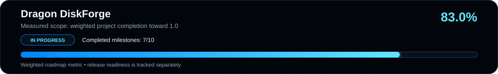

<!-- SWIR-README-STANDARD:v2 -->

<div align="center">



<br>


[](https://github.com/Swir)
[](https://github.com/Swir/Dragon-DiskForge/stargazers)


**Universal Disk Image Manager for Windows — inspect, mount, explore, verify and analyze images through verified capability paths.**

[**Status**](#current-development-version--050-beta1) · [**Foundation**](#proven-product-foundation) · [**Build**](#build-on-windows) · [**Safety**](#safety-design) · [**Roadmap**](docs/ROADMAP.md)

</div>


Dragon DiskForge is a WinUI 3 / .NET 10 desktop application and shared Core toolkit for inspecting, mounting, exploring, verifying and analyzing disk images. The project follows a strict truthful-capability rule: unsupported actions remain disabled until a real engine path exists and is verified.

## Current development version — 0.5.0-beta.1

Source and clean-package metadata are promoted to the `0.5.0-beta.1` candidate suffix. A retained, independently verified Windows x64 candidate exists from green `main`, but it is **not a public release**; interactive clean-desktop, normal-user UAC, real cross-process Explorer drag-out and final GitHub pre-release gates remain tracked in [`docs/BETA-RELEASE.md`](docs/BETA-RELEASE.md).

<!-- retained-beta-candidate:start -->
Current retained candidate: Beta Candidate run #79 (`35291908987`), artifact `DragonDiskForge-0.5.0-beta.1-win-x64-candidate-35291908987`, built from `main` source commit `a0483311bf000a995598b42ed9ec71019e63902e`; nested package SHA-256 `ecc4f0798ecc4d40fb9f77b433ae9dcbb206a358a9d2346bc9ac5411e8ba66a2`. It is a non-public engineering candidate, not a public release. Authoritative retained evidence: [`docs/retained-beta-candidate.json`](docs/retained-beta-candidate.json).
<!-- retained-beta-candidate:end -->

## Project progress — 83% toward 1.0



**Weighted project progress:** **83.0%** toward 1.0 · **Completed roadmap stages:** **7/10** · **Release readiness:** tracked separately in [`docs/BETA-RELEASE.md`](docs/BETA-RELEASE.md).

**Overall completion:** **83%**

- `0.1 Foundation + Dragon UI` — **100%** ✅
- `0.2 Native Mount + Unmount` — **100%** ✅
- `0.3 Dragon Explorer` — **100%** ✅
- `0.4 Extended Image Providers` — **100%** ✅
- `0.5 Partitions + File Systems + Image Intelligence` — **100%** ✅
- `0.6 Create + Convert + Verify` — **100%** ✅
- `0.7 Physical Media Tools` — **~86% (6/7)** 🚧
- `0.8 Windows Integration + Power Tools` — **100%** ✅
- `0.9 Quality, Security + Beta Hardening` — **~71% (5/7)** 🚧
- `1.0 Production Release` — planned

> Progress changes only after meaningful implementation and validation checkpoints. CI count, documentation-only edits and placeholders do not increase completion. Work may advance out of milestone order when a remaining milestone is blocked by a real hardware/manual gate.

## Proven product foundation

- native Windows ISO/VHD/VHDX read-only-first Mount + Unmount
- mounted-volume Dragon Explorer with navigation, search, Preview and safe Copy out
- Recent Images, Favorites, mount history and multi-image workspace
- safe Copy-only drag-out to Windows Explorer/Desktop
- managed ISO9660/Joliet direct browsing without mounting
- hardened canonical provider registry with truthful capabilities and deterministic resolution
- IMG/RAW, IMA/floppy, BIN/CUE, MDF/MDS, NRG, CCD/IMG/SUB, VMDK, QCOW/QCOW2, DMG/UDIF, WIM/ESD and FFU provider coverage
- bounded partition, filesystem, boot/install and image-intelligence services
- bounded QCOW2 and hosted-sparse VMDK guest-byte readers for explicitly supported uncompressed subsets
- guest-relative MBR/EBR/GPT and filesystem intelligence over proven guest-byte mappings
- user-facing **Analyze** action with text/JSON reporting and Save JSON
- SHA-256 + SHA-512 verification in one bounded sequential pass
- transactional RAW creation, guest-to-RAW export, split/join and bounded gzip transport pipelines
- checksum-verified clean Windows x64 package-candidate pipeline
- package-only clean-machine runtime matrix on fresh Windows runner images with no repository checkout and developer-toolchain paths removed before packaged entry-point probes
- read-only Windows physical-disk inventory and fail-closed physical-media planning/execution contracts
- gated Windows `PhysicalDriveN` writer candidate with target-volume locking/dismount, sector-aligned writes, flush and read-back SHA-256 verification; **not user-visible and not hardware-approved**
- shared-Core automation CLI with deterministic text/JSON output and safe local application-state tooling
- versioned session/settings persistence with best-effort last-image restore and sanitized diagnostic export
- reversible per-user Windows Open With/context-menu integration without default-app takeover
- bounded privacy-preserving crash history integrated into the support ZIP without raw exception messages, source-file paths or image contents
- large-image performance regression gate with machine-readable benchmark evidence for verification and bounded RAW/IMG recognition
- explicit desktop `asInvoker` execution plus repeatable security-boundary CI covering shell, CLI, package and destructive-write invariants
- explicit UI Automation names/help text, polite dynamic announcements, keyboard access keys and a repeatable accessibility XAML/WinUI build contract across the primary browsing surfaces
- required **by Swir** + GitHub footer in the Windows UI

## 0.7 Physical Media Tools — IN PROGRESS 🚧

The safety-first engineering scope remains **6/7 (~86%)**.

Dragon DiskForge contains a Windows physical writer **candidate** behind hard safety gates. It performs read-only source/destination preflight, rejects unprovable topology and source-on-target cases, locks/dismounts target volumes, uses sector-aligned bounded transfer, flushes the device and can perform read-back SHA-256 verification. A disposable-media harness requires explicit opt-in plus exact destination identity and confirmation binding.

PR #47 passed full Windows run #338 and Disposable Media Guard #10. Those results prove the code path and locked harness, **not real destructive hardware validation**. The final 0.7 deliverable remains open until the writer is exercised successfully on dedicated disposable media. No destructive physical-media action is exposed in the application UI.

See [`docs/PHYSICAL-MEDIA-SAFETY.md`](docs/PHYSICAL-MEDIA-SAFETY.md).

## 0.8 Windows Integration + Power Tools — COMPLETE ✅

All four top-level engineering deliverables are implemented and verified.

### Shared-Core CLI ✅

The clean Windows package includes a self-contained `cli/dragon-diskforge.exe` that reuses the same canonical Core provider registry as the desktop application.

```powershell
.\cli\dragon-diskforge.exe analyze .\sample.iso --format json
.\cli\dragon-diskforge.exe verify .\sample.iso --sha256 <64-hex-digest> --format json
.\cli\dragon-diskforge.exe formats --format json
```

Image inspection/verification commands remain read-only. The CLI also exposes narrowly scoped local application-state commands; it does not expose Create/Convert or physical-media mutation. See [`docs/CLI.md`](docs/CLI.md).

### PowerShell-friendly automation contract ✅

- text or one complete JSON document on stdout
- errors/diagnostics on stderr
- stable exit codes, including `4` for an expected checksum mismatch
- exact SHA-256/SHA-512 verification support
- package manifest stores the CLI entry point and SHA-256
- clean-package verification launches the unpacked self-contained CLI and validates the provider registry

### Session/settings/diagnostic portability ✅

- versioned application-state schema for settings and the last inspected image
- best-effort desktop last-image restore that never blocks startup on missing/corrupt state
- atomic state import/export through the Core safe-output boundary
- CLI `state-show`, `state-export`, `state-import` and `restore-last-image` commands with an optional isolated `--state` path
- sanitized diagnostic ZIP export containing runtime/provider evidence and session/settings summary without full image paths or image contents
- fail-closed schema/size/path validation plus dedicated smoke tests

### Windows shell integration ✅

The clean package includes `tools/dragon-diskforge-shell.exe`:

```powershell
.\tools\dragon-diskforge-shell.exe register
.\tools\dragon-diskforge-shell.exe status
.\tools\dragon-diskforge-shell.exe unregister
```

Registration is explicit, per-user and reversible. It derives the extension list from canonical `SupportedFormats`, adds Dragon DiskForge to Open With discovery plus an **Open with Dragon DiskForge** context-menu verb, and does **not** replace Windows `UserChoice`/default-app settings. Shell-launched supported images enter the normal desktop image-open pipeline and take precedence over saved-session restoration.

PR #50 implementation run #356 and Disposable Media Guard #28 passed before this milestone was marked complete. The clean package re-verifies the shell-helper SHA-256. Automated testing proves the registry/package/activation contract; Windows 11 may place classic verbs under **Show more options**, and visual clean-machine Explorer behavior remains later manual QA.

See [`docs/WINDOWS-SHELL-INTEGRATION.md`](docs/WINDOWS-SHELL-INTEGRATION.md).

## 0.9 Quality, Security + Beta Hardening — IN PROGRESS 🚧

Current scope: **5/7 (~71%)**.

### Crash + support evidence ✅

Unhandled WinUI failures are captured best-effort into a bounded rotated local crash history. Reports store only exception type, HRESULT, a SHA-256 fingerprint, exception-chain type names and method-only frames. Raw exception messages, source-file paths and image contents are intentionally excluded. The support ZIP includes at most three sanitized crash summaries and keeps using the existing transactional safe-output boundary.

### Large-image performance regression gate ✅

CI exercises real one-pass SHA-256/SHA-512 verification over a generated 128 MiB fixture and bounded filesystem recognition over a valid 8 GiB sparse RAW/IMG MBR fixture. The gate records timing, throughput and managed-allocation evidence, enforces conservative regression ceilings and publishes benchmark JSON as a dedicated artifact.

PR #51 implementation head `44a075a...` passed full Windows run #360 and Disposable Media Guard #32 before these roadmap items were marked complete. The first benchmark attempt correctly failed on an invalid blank RAW fixture; the test was fixed in the same iteration to use a real MBR-backed sparse fixture.

### Security boundary review ✅

The Windows desktop manifest explicitly remains `asInvoker` with `uiAccess=false`; ordinary startup therefore does not request ambient administrator elevation. A dedicated security-boundary workflow regression-tests the high-value architectural invariants: HKCU-only shell integration with no `UserChoice` takeover, public CLI isolation from the raw physical writer, clean-package debug/test exclusion and SHA-256 entry-point binding, destructive-writer CI lockout, physical-media fail-closed/confirmation cases and shell command quoting/injection rejection.

PR #52 exact implementation head `0ff048a...` passed full Windows build #367, Disposable Media Guard #39 and Security Boundary #1 before this roadmap item was marked complete. The review and its explicit limitations are documented in [`docs/SECURITY-BOUNDARIES.md`](docs/SECURITY-BOUNDARIES.md).

### Package-only clean-machine runtime matrix ✅

PR #53 adds a fresh-runner package validation path that builds the normal clean ZIP once and then hands only the ZIP, SHA-256 sidecar and runtime probe to `windows-2022` and `windows-latest` jobs with **no repository checkout**. The probe re-verifies package/manifest hashes and hygiene, removes .NET/Visual Studio/Git toolchain paths, exercises self-contained CLI provider/analyze/dual-hash/state/diagnostics paths and performs per-user shell register/status/unregister. Each matrix job publishes machine-readable OS/build/package/runtime evidence.

Exact implementation head `6451939...` passed full Windows build #374, Disposable Media Guard #46, Security Boundary #8 and Clean Machine Runtime #1 before this roadmap item was marked complete. See [`docs/CLEAN-MACHINE-RUNTIME.md`](docs/CLEAN-MACHINE-RUNTIME.md).

### Accessibility + keyboard hardening ✅

PR #54 adds explicit UI Automation names/help text to Direct Browse, Dragon Explorer, the multi-image workspace, Images and Mounted surfaces, plus polite live metadata for changing status/path/count/preview state and stable access keys for common actions. `scripts/accessibility-contract.ps1` fails on missing labels/live regions/named collections/progress indicators or duplicate per-view access keys, and the dedicated Windows workflow also compiles the WinUI x64 Release application.

Exact implementation head `69490fe...` passed Accessibility Contract #1, full Windows build #381, Disposable Media Guard #53, Security Boundary #15 and Clean Machine Runtime #8 before accessibility/keyboard hardening was marked complete. This is automated accessibility/keyboard hardening evidence, not formal accessibility certification or a human Narrator/NVDA/JAWS validation. See [`docs/ACCESSIBILITY.md`](docs/ACCESSIBILITY.md).

Remaining 0.9 work: normal-user UAC and real cross-process Explorer drag-out validation.

## 0.6 Create + Convert + Verify — COMPLETE ✅

The automated 0.6 engineering scope is complete: dual SHA verification, safe output transactions, blank RAW + proven guest-to-RAW export, transactional split/join and bounded whole-file gzip transport compression/decompression. Sparse-container writing and unsupported format-internal compression decoding are not claimed.

## 0.5 Partitions + File Systems + Image Intelligence — COMPLETE ✅

The automated 0.5 engineering scope is complete. Proven areas include cross-provider partition intelligence, physical and guest filesystem recognition, boot/installer intelligence, identity/health aggregation, Windows Analyze/reporting, deeper exFAT/FAT32/UDF/NTFS evidence, bounded UDF root traversal, QCOW2/VMDK guest readers and guest GPT/EBR integrity hardening.

Public beta publication remains a separate release decision gated by [`docs/BETA-RELEASE.md`](docs/BETA-RELEASE.md).

## Beta readiness

The planned first public beta remains **`0.5.0-beta.1`** and is **not ready yet**. Automated engineering, security-boundary, clean-package, package-only clean-machine runtime, accessibility-hardening and exact-candidate retention gates are green. The authoritative retained candidate is the exact run/source/package identity recorded above; it remains a non-public engineering candidate. These independent interactive/manual/release gates remain:

- human-confirmed clean supported Windows WinUI launch and basic open/mount/explore/verify/analyze regression
- normal-user UAC validation
- real cross-process Explorer drag-out validation
- final public ZIP + SHA-256 + GitHub pre-release publication

No empty, symbolic or CI-only beta will be published.

## Tech

- C# / .NET 10 / WinUI 3 / Windows App SDK
- x64 + ARM64 project targets
- shared Core engine separated from WinUI
- isolated Windows native-storage layer
- self-contained x64 CLI and shell-integration helper in the clean Windows package
- generated smoke/integration/performance fixtures rather than committed large images

## Build on Windows

Open `DragonDiskForge.sln` in Visual Studio and run `DragonDiskForge.App`, or use:

```powershell
.\scripts\build.ps1
```

CI validates Core, verification, safe output transactions, RAW pipelines, split/join + gzip, physical-media safety, provider invariants, partition/filesystem intelligence, reporting, QCOW2/VMDK guest-byte translation, all proven providers, Explorer safety, direct ISO integration, native Windows mount/inventory, shared-Core CLI/state portability, sanitized crash/support evidence, large-image performance regressions, shell integration, the dedicated security-boundary gate, the accessibility/keyboard XAML contract, Release x64 build, independently verified clean ZIP package candidate and package-only clean-machine runtime evidence across fresh Windows runner images.

## Safety design

Inspection and image/media automation remain read-only-first. Native mounts default to read-only. Parsers validate offsets/lengths and reject contradictory or unsupported states instead of guessing. CLI state/settings commands are restricted to Dragon DiskForge local application state and diagnostic export; they do not modify inspected images or physical media. Shell integration is opt-in, per-user and reversible and never overwrites the user's default-app choice. The desktop process is explicitly `asInvoker`; operations that need privileges must fail truthfully rather than relying on ambient elevation.

Crash evidence is bounded and privacy-preserving: raw exception messages, source-file paths and image contents are never persisted. Performance fixtures are generated locally and deleted after the regression run.

Physical-device mutation remains outside the product surface. The Windows writer candidate is kept behind explicit identity/topology/confirmation checks and a disposable-media validation harness; it does not become a user-visible capability until real dedicated-media validation proves the remaining 0.7 gate.

## Project rule

**No fake features.** A capability becomes enabled in the UI only after its real backing path exists and is testable.

Development is tracked in [`docs/ROADMAP.md`](docs/ROADMAP.md), with execution state in [`docs/STATUS.md`](docs/STATUS.md), [`docs/MILESTONES.md`](docs/MILESTONES.md), [`docs/CLI.md`](docs/CLI.md), [`docs/WINDOWS-SHELL-INTEGRATION.md`](docs/WINDOWS-SHELL-INTEGRATION.md), [`docs/SECURITY-BOUNDARIES.md`](docs/SECURITY-BOUNDARIES.md), [`docs/CLEAN-MACHINE-RUNTIME.md`](docs/CLEAN-MACHINE-RUNTIME.md), [`docs/ACCESSIBILITY.md`](docs/ACCESSIBILITY.md) and [`CHANGELOG.md`](CHANGELOG.md).

## 🔎 Search Keywords

`disk image manager windows` • `ISO manager Windows` • `VHD VHDX explorer` • `disk image analyzer` • `partition inspection tool` • `filesystem analysis Windows` • `QCOW2 VMDK reader` • `DMG WIM ESD FFU inspector` • `disk image checksum verifier` • `WinUI 3 disk utility` • `.NET disk image tool` • `Windows image mount tool` • `ISO9660 Joliet browser` • `disk image CLI` • `physical disk diagnostics` • `Dragon DiskForge`


<div align="center">

### `INSPECT • VERIFY • MOUNT • EVOLVE`

⭐ **If Dragon DiskForge is useful to you, consider leaving a star.**

[**← SWIR profile**](https://github.com/Swir) · [**All projects →**](https://github.com/Swir?tab=repositories)

</div>
