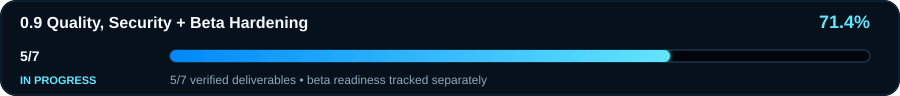

# Dragon DiskForge — Roadmap

This roadmap tracks implemented, testable product deliverables. A checkbox is completed only when a real backing path exists and the required verification has passed. Documentation, placeholders and CI-only work do not count as feature completion.

## Overall progress — 83% toward 1.0

`█████████████████░░░ 83%`

- **0.1 Foundation + Dragon UI — COMPLETE ✅**
- **0.2 Native Mount + Unmount — COMPLETE ✅**
- **0.3 Dragon Explorer — COMPLETE ✅**
- **0.4 Extended Image Providers — COMPLETE ✅**
- **0.5 Partitions + File Systems + Image Intelligence — COMPLETE ✅**
- **0.6 Create + Convert + Verify — COMPLETE ✅**
- **0.7 Physical Media Tools — 6/7 (~86%) 🚧**
- **0.8 Windows Integration + Power Tools — COMPLETE ✅**
- **0.9 Quality, Security + Beta Hardening — 5/7 (~71%) 🚧**
- **1.0 Production Release — planned**

**Current active milestone:** **0.9 Quality, Security + Beta Hardening — 5/7 verified deliverables (71.4%), IN PROGRESS.**

Release readiness remains a separate gate tracked in [`BETA-RELEASE.md`](BETA-RELEASE.md); the progress graphic does not imply beta readiness.

Work may advance out of milestone order when an earlier milestone is blocked by a real hardware/manual validation gate. The remaining 0.7 hardware gate is not weakened by progress in later milestones.

## 0.1 Foundation + Dragon UI — COMPLETE ✅

- [x] WinUI 3 / .NET 10 application foundation
- [x] shared Core separation
- [x] Dragon visual identity and custom application icon
- [x] responsive/accessibility resources
- [x] initial image inspection and SHA verification foundation

## 0.2 Native Mount + Unmount — COMPLETE ✅

- [x] Windows ISO/VHD/VHDX native mount path
- [x] read-only-first mount semantics
- [x] mount/unmount state detection
- [x] progress/cancellation
- [x] Windows integration coverage

## 0.3 Dragon Explorer — COMPLETE ✅

- [x] mounted-volume navigation/search
- [x] Preview and safe Copy out
- [x] Recent Images/Favorites/history
- [x] multi-image workspace
- [x] Copy-only Explorer drag-out safety
- [x] provider-backed direct ISO9660/Joliet browsing

## 0.4 Extended Image Providers — COMPLETE ✅

- [x] deterministic provider registry with failure isolation and truthful capabilities
- [x] IMG/RAW
- [x] IMA/floppy
- [x] BIN/CUE
- [x] MDF/MDS
- [x] NRG
- [x] CCD/IMG/SUB
- [x] VMDK metadata
- [x] QCOW/QCOW2 metadata
- [x] DMG/UDIF metadata
- [x] WIM/ESD metadata
- [x] FFU metadata
- [x] provider-contract hardening

## 0.5 Partitions + File Systems + Image Intelligence — COMPLETE ✅

- [x] cross-provider MBR/EBR/GPT partition intelligence
- [x] bounded physical filesystem recognition
- [x] BIOS/UEFI bootability and installer recognition
- [x] architecture/label/UUID/GUID/health intelligence
- [x] Windows Analyze surface with text/JSON reporting
- [x] deeper exFAT/FAT32/UDF/NTFS evidence
- [x] bounded UDF root traversal
- [x] QCOW2 guest-byte reader for the proven uncompressed subset
- [x] hosted-sparse VMDK guest-byte reader for the proven subset
- [x] guest-relative partition/filesystem intelligence
- [x] guest GPT/EBR integrity hardening

Public beta publication is a separate release decision governed by `docs/BETA-RELEASE.md`.

## 0.6 Create + Convert + Verify — COMPLETE ✅

- [x] SHA-256 + SHA-512 in one bounded sequential pass
- [x] safe output transaction boundary
- [x] blank RAW creation + proven guest-byte → RAW materialization
- [x] transactional split/join with versioned SHA-256 manifest
- [x] bounded whole-file gzip transport compression/decompression

Sparse-container writing, QCOW2 compressed clusters, VMDK stream-optimized decoding and DMG `blkx` decompression are not claimed.

## 0.7 Physical Media Tools — IN PROGRESS 🚧

Current scope: **6/7 (~86%)**.

- [x] read-only Windows physical-disk inventory
- [x] capacity/bus/removable/vendor/product/revision/serial/system-disk evidence
- [x] hard refusal policy for system disks, ambiguous identity and unknown capacity
- [x] source/destination write-plan preview with same-device/oversize refusal
- [x] exact destination-bound destructive confirmation contract
- [x] bounded execution/fail-safe recovery contract with a hard-gated Windows writer candidate
- [ ] separately validate the Windows physical writer on dedicated disposable media under the documented safety protocol

PR #47 adds the Windows writer candidate, read-only source/target topology preflight, target-volume lock/dismount, sector-aligned bounded transfer, device flush, read-back SHA-256 and a hard-locked disposable-media harness. Run #338 and Disposable Media Guard #10 passed, but they do **not** substitute for a real destructive-media test. No destructive physical-media action is user-visible.

See `docs/PHYSICAL-MEDIA-SAFETY.md`.

## 0.8 Windows Integration + Power Tools — COMPLETE ✅

Current scope: **4/4 (100%)**.

- [x] Windows file associations and context-menu integration
- [x] shared-Core read-only image/verification CLI (`analyze`, `verify`, `formats`)
- [x] PowerShell-friendly deterministic text/JSON output, stderr diagnostics and stable exit codes
- [x] session restore + settings import/export + sanitized diagnostic export tooling

The shell-integration path is per-user and reversible. It registers Dragon DiskForge under `HKCU\Software\Classes`, derives its extension set from canonical `SupportedFormats`, adds an explicit **Open with Dragon DiskForge** verb, and deliberately does not replace Windows `UserChoice` defaults. The clean package includes the self-contained registration helper plus manifest/hash verification. Command-line file activation feeds the same image-open path as normal desktop opens.

PR #50 implementation run #356 and Disposable Media Guard #28 passed before this milestone was marked complete. Automated validation proves the registry/package/startup contract; clean-machine visual Explorer behavior remains part of later manual quality/release QA rather than being overstated here.

See `docs/CLI.md` and `docs/WINDOWS-SHELL-INTEGRATION.md`.

## 0.9 Quality, Security + Beta Hardening — IN PROGRESS 🚧

Current scope: **5/7 (~71%)**.

- [x] clean-machine runtime matrix
- [ ] normal-user UAC validation
- [ ] real cross-process Explorer drag-out validation
- [x] accessibility/keyboard/screen-reader hardening
- [x] performance and large-image regression benchmarks
- [x] security review of parsing, packaging and privileged boundaries
- [x] crash/diagnostic export and release support bundle

PR #51 adds a privacy-preserving crash-report history and integrates up to three sanitized crash summaries into the support ZIP. It also adds a large-image performance regression gate using real Core verification plus bounded recognition over an 8 GiB sparse RAW/IMG fixture. Full Windows run #360 and Disposable Media Guard #32 passed on the implementation head before these two deliverables were marked complete.

PR #52 completes the repeatable security-boundary review: the desktop manifest is explicitly pinned to `asInvoker` with UI access disabled, a dedicated security CI gate checks elevation/shell/CLI/package/destructive-writer boundaries, physical-media refusal and confirmation cases are exercised, and the reviewed architecture is documented in `docs/SECURITY-BOUNDARIES.md`. Exact implementation head `0ff048a...` passed full Windows build #367, Disposable Media Guard #39 and Security Boundary #1 before this deliverable was marked complete.

PR #53 adds a package-only clean-machine runtime matrix. The clean package is built once and then exercised on fresh `windows-2022` and `windows-latest` jobs with no repository checkout; ZIP/manifest hashes, package hygiene, self-contained CLI analyze/verify/state/diagnostics and per-user shell register/status/unregister are verified after developer toolchain paths are removed. Exact implementation head `6451939...` passed full Windows build #374, Disposable Media Guard #46, Security Boundary #8 and Clean Machine Runtime #1 before this deliverable was marked complete.

PR #54 hardens the beta-facing WinUI navigation/browsing surfaces with explicit UI Automation names/help text, polite live status announcements, named list/tab collections and keyboard access keys. A dedicated accessibility regression contract parses the hardened XAML and fails on missing labels/live regions or duplicate per-view access keys, while its Windows workflow also compiles the WinUI application. Exact implementation head `69490fe...` passed Accessibility Contract #1, full Windows build #381, Disposable Media Guard #53, Security Boundary #15 and Clean Machine Runtime #8 before this deliverable was marked complete. This is automated accessibility/keyboard hardening evidence; it does not claim a human Narrator/assistive-technology certification run.

Crash evidence is bounded and deliberately excludes raw exception messages, source-file paths and image contents. The performance gate publishes benchmark JSON while using conservative ceilings intended to detect major regressions rather than claim hardware-independent absolute speed. The security, clean-machine and accessibility gates prove stated code/package/runtime invariants, not the remaining interactive UAC/Explorer or dedicated-media manual gates.

See `docs/CLEAN-MACHINE-RUNTIME.md` and `docs/ACCESSIBILITY.md`.

## 1.0 Production Release — PLANNED

- [ ] all production release gates green
- [ ] stable Windows package and checksums
- [ ] final supported-format/capability matrix
- [ ] complete end-user documentation
- [ ] signed/tagged GitHub production release
- [ ] post-release clean installation and runtime verification

## Public beta track

The planned first public beta remains **`0.5.0-beta.1`**. It is not considered ready until every required item in `docs/BETA-RELEASE.md` is actually verified. The package-only clean-machine matrix and automated accessibility hardening are green, but interactive clean-desktop/UAC/Explorer and final release gates remain independent requirements.
